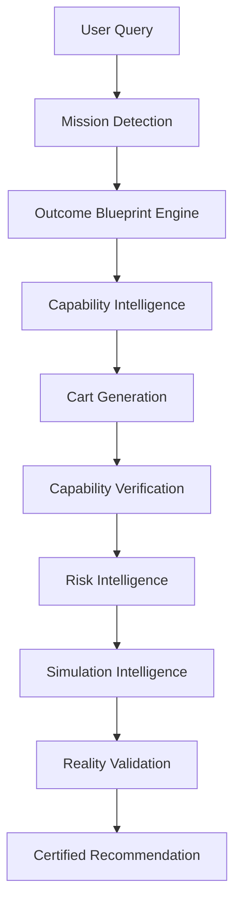

# Amazon LifeGraph Backend

## Project Overview
Amazon LifeGraph is a **mission-centric commerce intelligence platform** powered by the **Outcome Intelligence Platform (OIP)**. The backend supports a Commerce Knowledge Graph, AI-augmented decision agents, and an end-to-end recommendation pipeline — from user intent to certified, production-grade output. It uses a single-table DynamoDB design and adheres to Clean Architecture principles.

---

## System Architecture

The platform follows a unified **Outcome Blueprint → Capability → Cart** pipeline:



### Key Components

| Component | Purpose |
| :--- | :--- |
| **Mission Detection** | Classifies user intent into a mission ID (e.g., `weight_loss_journey`, `monthly_grocery_refill`). |
| **Outcome Blueprint Engine** | Defines required outcome groups and success criteria per mission. |
| **Capability Intelligence** | Maps missions to concrete capabilities (e.g., `protein_intake`, `fiber_intake`). |
| **Cart Generation** | Round-robin, diversity-aware product selection from the Commerce Knowledge Graph. |
| **Capability Verification** | Validates cart coverage against blueprint requirements and capability targets. |
| **Risk Intelligence** | Evaluates failure probability based on readiness, budget, and missing items. |
| **Simulation Intelligence** | Predicts mission success probability with and without recommended additions. |
| **Policy Engine** | Enforces certification rules (TRUSTED / WARNING / AUTO_REPAIRED / FAILED). |
| **Runtime Truth Engine** | Verifies actual execution path (Bedrock live vs. simulation fallback). |

### AI Agent Layer

Six specialized AI agents augment the deterministic pipeline via AWS Bedrock (Meta Llama 3 70B):

1. **Mission Agent** — Intent classification and constraint detection
2. **Cart Agent** — Product alignment and safety filtering
3. **Verification Agent** — Readiness scoring adjustments
4. **Risk Agent** — Risk level calibration
5. **Regret Prevention Agent** — Forgotten items detection
6. **Simulation Agent** — Success probability optimization

All AI changes are validated through a **Grounding Engine** (catalog + graph + business rules) and bounded by deterministic caps to prevent hallucination drift.

---

## Setup & Local Development

### 1. Installation
1. Clone the repository: `git clone https://github.com/YESH-ctrl/LifeGraph.git`
2. Set up a virtual environment: `python -m venv venv`
3. Activate the environment:
   - Windows: `venv\Scripts\activate`
   - Unix: `source venv/bin/activate`
4. Install dependencies: `pip install -r src/requirements.txt`

### 2. Environment Variables

| Variable | Values | Description |
| :--- | :--- | :--- |
| `MODE` | `BEDROCK_LIVE` / `LOCAL_SIMULATION` | Controls AI execution path. |
| `AWS_REGION` | `ap-south-1` (default) | AWS region for Bedrock runtime. |

### 3. Local Verification Server
We use FastAPI to provide a local verification environment without needing to deploy AWS SAM. 
Run the local server:
```bash
python -m uvicorn src.local_app:app --reload
```

### 4. Swagger Interface
Once the local server is running, navigate to:
**http://127.0.0.1:8000/docs**

Here you can interactively test the Users, Products, Carts, and AI Agent/Orchestration APIs, verifying request payloads, response envelopes, and database interactions.

---

## Capability Intelligence Layer

The **Capability Intelligence Layer** converts user intent into granular capability requirements to optimize recommendation quality, coherence, and safety.

### Mission to Capability Mappings
Missions are mapped to specific capability buckets:
- **Weight Loss Journey (`weight_loss_journey`)**: `protein_intake`, `fiber_intake`, `calorie_control`, `satiety`, `hydration`
- **Healthy Lifestyle Start (`healthy_lifestyle_start`)**: `balanced_macros`, `micronutrients`, `whole_foods`
- **Weekly Grocery / Weekend Cooking**: `staple_coverage`, `meal_variety`, `cost_efficiency`
- **Monthly Grocery Refill / General Refill**: `pantry_refill`, `household_consumables`, `repeat_purchase_items`

### 4-Part Weighted Product Scoring Algorithm

$$\text{Final Score} = 0.40 \times C_{cov} + 0.30 \times N_{qual} + 0.20 \times M_{rel} + 0.10 \times E_{cost}$$

| Weight | Score Dimension | Evaluation Logic |
| :---: | :--- | :--- |
| **40%** | **Capability Coverage ($C_{cov}$)** | Percentage of required capabilities matched by product metadata. |
| **30%** | **Nutritional Quality ($N_{qual}$)** | Organic/whole-foods score 95; basic staples 80; processed items 50. |
| **20%** | **Mission Relevance ($M_{rel}$)** | Required items 100; optional 80; hint matches 70. |
| **10%** | **Cost Efficiency ($E_{cost}$)** | Score decays with price: $100 - (price / 5)$, clamped 10–100. |

---

## Verification & Certification

### Unified Readiness Score
The readiness score is computed from three components:
- **Capability Completion** (40%): Percentage of required capabilities satisfied
- **Group Completion** (40%): Percentage of required outcome groups covered
- **Product Diversity** (20%): Distribution across distinct product categories

### Certification Tiers

| Status | Requirements |
| :--- | :--- |
| **TRUSTED** | `grounding >= 95`, `catalog_validity == 100`, `graph_validity == 100`, `reality >= 80`, `consistency >= 95` |
| **WARNING** | Minor issues detected, response is valid |
| **AUTO_REPAIRED** | Policy engine auto-corrected issues (empty cart, invalid risk) |
| **FAILED** | Critical validation failure, response blocked |

---

## Testing

### Run Full Test Suite
```bash
cd src
python -m pytest ../tests_v2/ -v
```

### Run 25-Query Benchmark
```bash
python benchmark_consolidation.py
```

The benchmark validates:
- All 25 diverse queries produce valid responses
- Blueprint-driven verification (no legacy keyword matching)
- Average latency < 10s
- Average reality score >= 85
- Average override rate < 20%

---

## Project Structure

```
src/
├── orchestration/           # Master Orchestrator (entry point)
├── engines/domains/
│   ├── mission_detection/   # Mission classification
│   ├── cart_generation/     # Diversity-aware product selection
│   ├── verification/        # Capability & blueprint verification
│   ├── risk/                # Risk scoring
│   ├── regret_prevention/   # Forgotten items detection
│   ├── simulator/           # Success probability simulation
│   ├── capability_intelligence_service.py
│   ├── product_diversity_engine.py
│   └── unified_readiness_engine.py
├── shared/
│   ├── ai/
│   │   ├── providers/       # Bedrock & Claude providers
│   │   ├── grounding/       # Grounding, consistency, calibration
│   │   ├── policy/          # Policy engine, runtime truth
│   │   ├── evaluation/      # Evaluation, replay, A/B testing
│   │   ├── validators/      # Hallucination detection, confidence
│   │   ├── agents.py        # AI agent definitions
│   │   ├── ai_gateway.py    # Unified inference gateway
│   │   └── prompt_manager.py
│   └── domain/
│       └── outcome_blueprint_engine.py
├── foundation/
│   ├── graph/               # Commerce Knowledge Graph (DynamoDB)
│   └── domains/             # Memory, Cart, Product services
├── api/                     # Lambda handlers
├── app.py                   # SAM application entry
└── local_app.py             # FastAPI local server
```

---

## Branching Strategy
We follow a structured branching strategy to enable concurrent team collaboration:

- **main**: Production-ready code. No direct commits allowed.
- **develop**: Integration branch.
- **feature/***: Developer branches (e.g., `feature/graph-engine`, `feature/verification-risk`).

### Pull Request Workflow
1. Create a feature branch from `develop`.
2. Commit your changes locally.
3. Open a Pull Request targeting `develop`.
4. Code review and integration testing.
5. Merge into `develop`.
6. Once `develop` is stable, it will be merged into `main`.
