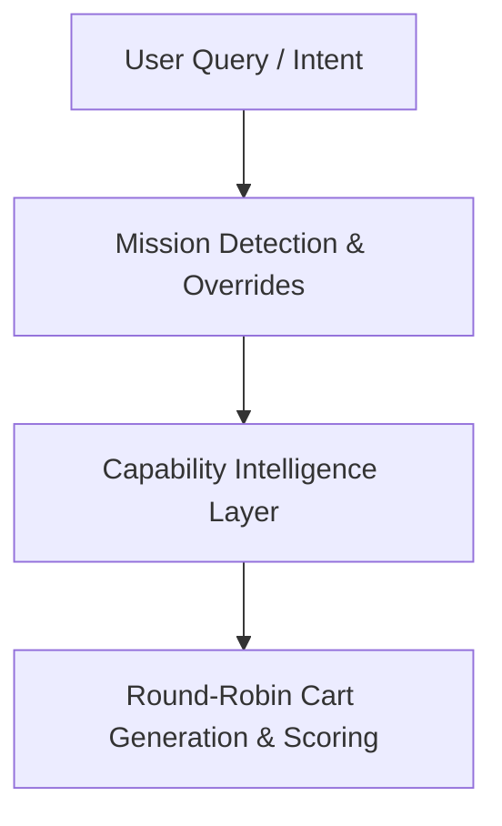

# Amazon LifeGraph Backend

## Project Overview
Amazon LifeGraph is a mission-centric commerce intelligence platform. The backend supports the Commerce Knowledge Graph and various engines (Outcome Verification, Decision Risk, Adaptive Decision, etc.). It uses a single-table DynamoDB design, adhering to Clean Architecture principles.

## System Architecture & Intent Flow
The platform is designed around the **Capability Intelligence Layer**, which shifts retrieval from simple keyword-to-product mapping to outcome-focused requirement fulfillment:



### Key Components:
- **Mission Intelligence**: Detects core user missions and handles logic verification/overrides.
- **Capability Intelligence Layer**: Translates detected missions into concrete, required capabilities/needs.
- **Product Engine**: Queries the graph, evaluates, scores, and packages selections into a balanced cart.

---

## Setup & Local Development

### 1. Installation
1. Clone the repository: `git clone https://github.com/YESH-ctrl/LifeGraph.git`
2. Set up a virtual environment: `python -m venv venv`
3. Activate the environment:
   - Windows: `venv\Scripts\activate`
   - Unix: `source venv/bin/activate`
4. Install dependencies: `pip install -r src/requirements.txt`

### 2. Local Verification Server
We use FastAPI to provide a local verification environment without needing to deploy AWS SAM. 
Run the local server:
```bash
python -m uvicorn src.local_app:app --reload
```

### 3. Swagger Interface
Once the local server is running, navigate to:
**http://127.0.0.1:8000/docs**

Here you can interactively test the Users, Products, Carts, and AI Agent/Orchestration APIs, verifying request payloads, response envelopes, and database interactions.

---

## Capability Intelligence Layer Details

The **Capability Intelligence Layer** converts user intent into granular capability requirements to optimize recommendation quality, coherence, and safety.

### 1. Mission to Capability Mappings
Missions are mapped to specific capability buckets:
- **Weight Loss Journey (`weight_loss_journey`)**:
  - `protein_intake`: High-protein items (eggs, whey, almonds, paneer, tofu, fish, chicken).
  - `fiber_intake`: High-fiber items (oat, seeds, chia, quinoa, dry fruits, muesli).
  - `calorie_control`: Diet/zero-sugar alternatives (green tea, stevia, unsweetened).
  - `satiety`: Filling, slow-digesting foods (oats, wheat, dal, lentils).
  - `hydration`: Healthy hydration sources (coconut water, green tea, water).
- **Healthy Lifestyle Start (`healthy_lifestyle_start`)**:
  - `balanced_macros`, `micronutrients`, `whole_foods`.
- **Weekly Grocery Shopping / Weekend Cooking (`weekly_grocery_shopping`, `weekend_cooking_session`)**:
  - `staple_coverage` (rice, oil, dal, flour), `meal_variety` (butter, spreads, cheese, masala), `cost_efficiency`.
- **Monthly Grocery Refill (`monthly_grocery_refill`) / General Refill (`general_refill`)**:
  - `pantry_refill`, `household_consumables` (cleansers, detergents), `repeat_purchase_items` (milk, bread).

### 2. 4-Part Weighted Product Scoring Algorithm
Products matching the mission's requirements are ranked using the following formula:

$$\text{Final Score} = 0.40 \times C_{cov} + 0.30 \times N_{qual} + 0.20 \times M_{rel} + 0.10 \times E_{cost}$$

| Weight | Score Dimension | Evaluation Logic |
| :---: | :--- | :--- |
| **40%** | **Capability Coverage ($C_{cov}$)** | Percentage of the mission's required capabilities matched by the product's title, category path, subcategory, and semantic tags. |
| **30%** | **Nutritional Quality ($N_{qual}$)** | Hardcoded nutrition grade: Organic, whole-foods, seeds, nuts score **95**; basic staples score **80**; processed junk/non-food items score **50**. |
| **20%** | **Mission Relevance ($M_{rel}$)** | Required items score **100**; optional items score **80**; matches in primary/secondary missions score **90**; hint matches score **70**. |
| **10%** | **Cost Efficiency ($E_{cost}$)** | Score decays with price: $100.0 - (\text{Price} / 5.0)$, clamped between $10.0$ and $100.0$. |

### 3. Capability Coverage API & Metrics
Cart Generation endpoint (`/engines/cart-generation`) performs round-robin capability retrieval to build balanced carts. The system exposes and tracks these key metrics:
- **Cart Capability Coverage**: The percentage of required capabilities successfully satisfied by the items present in the selected cart.
- **Recommendation Quality (Coherence)**: Evaluated dynamically to ensure zero non-catalog entities are generated.

---

## Branching Strategy
We follow a structured branching strategy to enable concurrent team collaboration:

- **main**: Production-ready code. No direct commits allowed.
- **develop**: Integration branch.
- **feature/*** : Developer branches (e.g., `feature/graph-engine`, `feature/verification-risk`).

### Pull Request Workflow
1. Create a feature branch from `develop`.
2. Commit your changes locally.
3. Open a Pull Request targeting `develop`.
4. Code review and integration testing.
5. Merge into `develop`.
6. Once `develop` is stable, it will be merged into `main`.
