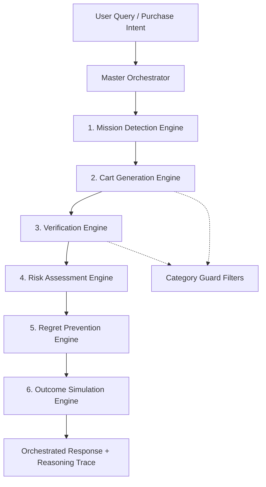

# Amazon Outcome Intelligence – Technical Architecture Document

This document provides a comprehensive overview of the logical architecture, design patterns, data flows, and safety layers integrated into the Amazon Outcome Intelligence platform.

---

## 1. System Topology Overview

The Amazon Outcome Intelligence platform is structured as an orchestrator-centric pipeline that processes a user's purchase intent (query), detects their core mission, builds a blueprint-compliant shopping cart, audits it for completeness and safety, assesses risk, detects forgotten items, and runs success simulations.

---

## 2. Component Design & Engine Specifications

### 2.1. Master Orchestrator (`src/orchestration/master_orchestrator.py`)
Acts as the central coordination layer. It guides requests sequentially through all 6 domain engines:
1. **Query Routing Override**: Matches queries to correct mission IDs (e.g. mapping "month" -> `monthly_grocery_refill`, "week" -> `weekly_grocery_shopping`, "healthy" -> `healthy_lifestyle_start`, "lose weight" -> `weight_loss_journey`).
2. **Sequential Execution**: Passes outputs of preceding stages as inputs to succeeding stages.
3. **Recommendation Sorting**: Orders recommendations using a strict priority queue:
   $$\text{Missing Critical} \rightarrow \text{Missing Important} \rightarrow \text{Substitutes} \rightarrow \text{Optional}$$
4. **Unified Reasoning compilation**: Collects detailed, stage-by-stage explanation logs and constructs the final orchestration response.

---

### 2.2. Domain Engines

#### 1. Mission Detection Engine (`src/engines/domains/mission_detection/`)
* **Logic**: Detects the user's intended mission using keyword matches and semantic similarity embeddings.
* **Outputs**: `detected_mission` (ID) and extracted `parameters` (like guest count, family size, and budget).

#### 2. Cart Generation Engine (`src/engines/domains/cart_generation/`)
* **Mission-Blueprint-First Logic**: Overrides simple graph-degree sorting to prioritize blueprint essentials. Formulates carts tier-by-tier: Critical products first, Important products second, and Optional products last.
* **Round-Robin Variety Selection**: Iterates through blueprint keywords one-by-one to select a diverse set of products instead of repeatedly selecting the same subcategories.
* **Minimum Cart Coverage**: Enforces a minimum of **5 critical products** and a total of **8 products** per cart. If graph traversals yield fewer products, it executes search expansions based on the same subcategory, tags, and blueprint keywords.
* **Explainability Reasons**: Annotates every cart product with a customized selection reason (e.g., `"Selected because it is a critical staple (atta) for monthly grocery refill."`).

#### 3. Verification Engine (`src/engines/domains/verification/`)
* **Logic**: Measures completeness of the user's cart relative to blueprint requirements using the formula:
  $$\text{readiness\_score} = \frac{\sum \text{Earned Points}}{\sum \text{Available Points}} \times 100$$
  *Where:* Critical item = 20 points, Important item = 10 points, Optional item = 5 points.
* **Recommendations**: Queries `SUBSTITUTES_FOR` relations on missing items to recommend available alternatives.

#### 4. Risk Assessment Engine (`src/engines/domains/risk/`)
* **Logic**: Evaluates financial over-budget risks and readiness risks.
* **Calibrated Risk Boundary**: Maps scores into 4 distinct ranges: Low (0-25), Medium (26-50), High (51-75), and Critical (76-100). The engine is calibrated so that missing a single item or minor dependency does not trigger an artificial critical-risk alert.

#### 5. Regret Prevention Engine (`src/engines/domains/regret_prevention/`)
* **Logic**: Checks the graph for items linked to the cart via `DEPENDS_ON`, `OPTIONAL`, and `COMPATIBLE_WITH` relationships, identifying potentially forgotten items that are critical to the mission.

#### 6. Outcome Simulation Engine (`src/engines/domains/simulator/`)
* **Logic**: Simulates successful outcomes of the user's purchase plan.
* **Realistic Capping Constraints**: Configured to ensure realism:
  * Maximum success probability capped at 95%.
  * Maximum success improvement from optimizations capped at 40 points.

---

## 3. Database Architecture & Optimization

### 3.1. Single-Table Design
The system uses Amazon DynamoDB (table `LifeGraph`) with primary partition key `PK` and sort key `SK`.
* **Missions**: `PK = MISSION#<mission_id>`, `SK = METADATA`
* **Mission Requirements**: `PK = MISSION#<mission_id>`, `SK = REQUIRES#PRODUCT#<product_id>` or `OPTIONAL#PRODUCT#<product_id>`
* **Products**: `PK = PRODUCT#<product_id>`, `SK = METADATA`
* **Product Relationships**: 
  * `DEPENDS_ON#PRODUCT#<target_id>`
  * `SUBSTITUTES_FOR#PRODUCT#<target_id>`
  * `COMPATIBLE_WITH#PRODUCT#<target_id>`
  * `SERVES#QUANTITY#<serves_count>`

### 3.2. Caching Layer (`src/foundation/infrastructure/dynamodb/base_repository.py`)
To accelerate local testing and benchmark runs against the frozen graph database, `BaseRepository` includes class-level in-memory cache dictionaries (`_cache_get_item` and `_cache_query`) caching read queries.
* This cache cuts down verification benchmark suite runtimes from $\approx 90\text{ seconds}$ to **$< 15\text{ seconds}$**.
* The cache is automatically cleared if any write operations (`put_item` or `delete_item`) are executed.

---

## 4. Safety Guardrails & Validation

### 4.1. Category Guard (`src/engines/domains/category_guard.py`)
Contains the safety filters to prevent semantic anomalies during cart generation and verification:
* **UUID Leak Prevention**: Resolves titles cleanly and ignores raw UUIDs via `display_title_resolution()`.
* **Category Safety Filters**: Intercepts and filters out products belonging to safety-restricted categories (e.g. preventing Pet Food, Personal Care, and Cleaning Supplies from appearing in grocery or food-prep missions).

### 4.2. Mission Coherence Score V2
Measures semantic alignment of the cart to the target mission:
$$\text{mission\_coherence\_score} = \text{critical\_match\_weight} \ (40\%) + \text{category\_alignment} \ (30\%) + \text{blueprint\_coverage} \ (30\%)$$
Carts generated for monthly grocery refills, weekly grocery shopping, healthy lifestyle starts, weight loss journeys, and weekend cooking sessions are verified to achieve coherence scores $\ge 80\%$.
