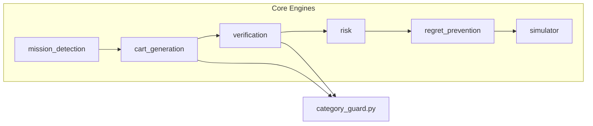

# Amazon Outcome Intelligence – Codebase File-by-File Reference Dictionary

This dictionary provides a file-by-file structural map of the **Amazon Outcome Intelligence** codebase. It is designed as a technical resource for architects, detailing the logical purpose, internal mechanics, and project-wide impact of every key file in the system.

---

## 1. Application Entry Points

### `src/app.py`
* **Logical Purpose**: The main FastAPI production server entry point.
* **Internal Mechanics**: Sets up the FastAPI app, registers CORS middleware, configures global exception handlers, and mounts core routing controllers (cart, mission, product, workflow, prevention).
* **Project Impact**: Exposes public endpoint API interfaces for production runtime.
* **Key Dependencies**: Relies on `src/api/controllers/` to handle routing traffic and `foundation.core.config` for global variables.

### `src/local_app.py`
* **Logical Purpose**: A developer-focused FastAPI entry point containing auxiliary debugging endpoints.
* **Internal Mechanics**: Implements identical router mappings as `app.py` but registers extra helper routes for raw graph inspections, mock data seeding, and local sandbox testing.
* **Project Impact**: Used for local developer servers (`npm run dev` equivalents) and integrations with local DynamoDB clients.
* **Key Dependencies**: Standard API controllers.

---

## 2. API Controller Layer (`src/api/controllers/`)

These files serve as adapters that map incoming HTTP request schemas (often parsed from Lambda events or FastAPI routes) to domain service invocations.

* **`cart_controller.py`**
  * *Purpose*: Maps endpoints like `/cart/generate` to the cart generation engine.
  * *Impact*: Parses parameters (like guest count, family size) and returns the formed cart.

* **`graph_controller.py`**
  * *Purpose*: Provides raw read/write interfaces to product and mission nodes in the DynamoDB knowledge graph.
  * *Impact*: Enables inspection of the underlying nodes and relationship edges.

* **`mission_controller.py`**
  * *Purpose*: Exposes endpoints for mission detection and listing blueprint criteria.
  * *Impact*: Maps user text input directly to mission detection routing.

* **`prevention_controller.py`**
  * *Purpose*: Exposes endpoints for the Regret Prevention engine.
  * *Impact*: Identifies forgotten items before checkout based on cart contents.

* **`product_controller.py`**
  * *Purpose*: Interfaces with catalog search, metadata enrichment, and product retrieval.
  * *Impact*: Feeds lists of catalog products to client UIs.

* **`relationship_controller.py`**
  * *Purpose*: Exposes endpoints for reading/writing graph edges (e.g. `REQUIRES`, `DEPENDS_ON`, `SUBSTITUTES_FOR`).
  * *Impact*: Critical for debugging graph topology.

* **`risk_controller.py`**
  * *Purpose*: Interfaces with the Risk Assessment engine.
  * *Impact*: Exposes risk analysis based on current cart items.

* **`user_controller.py`**
  * *Purpose*: Handles user profile parameters and session management.
  * *Impact*: Stores state across user interactions.

* **`verification_controller.py`**
  * *Purpose*: Exposes verification scoring and recommendations for cart completion.
  * *Impact*: Audits if a cart satisfies the requirements of a detected mission.

* **`workflow_controller.py`**
  * *Purpose*: Exposes the Master Orchestrator outcomes API (`POST /orchestrator/outcome-intelligence`).
  * *Impact*: The primary unified gateway endpoint running the full 6-stage outcome intelligence sequence.

---

## 3. Intelligence Engines & Domains (`src/engines/domains/`)

This directory houses the core business logic of the six sequential decision engines.

### 3.1. Category Guard & display_title_resolution()
* **`category_guard.py`**
  * *Logical Purpose*: The central safety firewall of the system.
  * *Internal Mechanics*: 
    - `display_title_resolution()`: Sanitizes title formats, prioritizing `title` -> `name` -> `embeddingText` values, and filters out UUID leaks.
    - `get_product_safety_tags()`: Scans strings for keywords mapping to safety groups (`PET_FOOD`, `BABY_CARE`, `PERSONAL_CARE`, `HOUSEHOLD_CLEANING`).
    - `check_mismatch()`: Rejects invalid items for specific missions (e.g., drops dog food from grocery shopping or soap from kitchen cooking missions).
  * *Project Impact*: Statically ensures no weird items leak into carts or verification routines. Crucial for demo sanitization.

---

### 3.2. Mission Detection Engine (`src/engines/domains/mission_detection/`)
* **`service.py`**
  * *Mechanics*: Performs text matching and confidence mapping.
* **`schemas.py`**
  * *Mechanics*: Holds request models representing queries.
* **`controller.py`**
  * *Mechanics*: Integrates service responses into routing controllers.

---

### 3.3. Cart Generation Engine (`src/engines/domains/cart_generation/`)
* **`service.py`**
  * *Logical Purpose*: Builds the initial cart from detected mission parameters.
  * *Internal Mechanics*:
    - Implements **Blueprint-First** keyword round-robin selections.
    - Tightens `"atta"` keyword checks to search strictly for actual `"atta"` titles.
    - Enforces **Minimum Cart Coverage** (size $\ge 8$, critical items $\ge 5$), falling back to same-subcategory, tags, and blueprint-keyword search expansions when graph nodes are sparse.
    - Emits explainable selection reasons per product.
    - Compiles the final **Mission Coherence Score** using weighted percentages (40% Critical staples match, 30% Category guard alignment, 30% Blueprint keywords coverage).
  * *Project Impact*: Transforms the user's raw query into a highly contextualized initial cart.

---

### 3.4. Verification Engine (`src/engines/domains/verification/`)
* **`service.py`**
  * *Logical Purpose*: Measures cart readiness against blueprint targets.
  * *Internal Mechanics*: 
    - Calculates a weighted completeness score (Critical = 20, Important = 10, Optional = 5).
    - Scans graph `SUBSTITUTES_FOR` relationships on missing items to produce list of alternatives.
  * *Project Impact*: Tells the user what's missing and gives them alternative additions.

---

### 3.5. Risk Assessment Engine (`src/engines/domains/risk/`)
* **`service.py`**
  * *Logical Purpose*: Gauges budget, readiness, and substitute risks.
  * *Internal Mechanics*: Uses a calibrated risk scale (Low, Medium, High, Critical) ensuring that minor missing items do not generate false high-severity alerts.
  * *Project Impact*: Adds protective safety metrics prior to checkout.

---

### 3.6. Regret Prevention Engine (`src/engines/domains/regret_prevention/`)
* **`service.py`**
  * *Logical Purpose*: Flags items that the user likely forgot.
  * *Internal Mechanics*: Examines relationships like `DEPENDS_ON`, `OPTIONAL`, and `COMPATIBLE_WITH` originating from the items already present in the cart.
  * *Project Impact*: Proactively suggests useful add-ons.

---

### 3.7. Outcome Simulation Engine (`src/engines/domains/simulator/`)
* **`service.py`**
  * *Logical Purpose*: Simulates the final probability of mission success.
  * *Internal Mechanics*: Applies realistic caps (max success: 95%, max improvement: 40 points) to guarantee believable success metrics.
  * *Project Impact*: Inspires confidence in the user by visualizing cart completion value.

---

## 4. Foundation & Infrastructure (`src/foundation/`)

Provides configuration, constants, and DynamoDB data access wrappers.

* **`core/config.py`**
  * *Purpose*: Loads settings (e.g. `TABLE_NAME`, `REGION_NAME`) from environment variables.
  * *Impact*: Acts as the single config registry.

* **`infrastructure/dynamodb/client.py`**
  * *Purpose*: Low-level boto3 table client initiator.
  * *Impact*: Connects the app to local or AWS DynamoDB instances.

* **`infrastructure/dynamodb/base_repository.py`**
  * *Purpose*: Generic DynamoDB CRUD wrapper class (`BaseRepository`).
  * *Internal Mechanics*: Implements class-level read caches `_cache_get_item = {}` and `_cache_query = {}` to avoid redundant local DB queries and speed up validation runs. Caches are cleared on writes.
  * *Impact*: Fundamental performance wrapper for database efficiency.

* **`graph/repository.py`**
  * *Purpose*: Specialized graph database accessor (`GraphRepository`).
  * *Internal Mechanics*: Implements queries for mission rules, parameters, synonyms, product compatibility edges, and node metadata.
  * *Impact*: Powering all graph traversals.

---

## 5. Orchestration Layer (`src/orchestration/`)

* **`master_orchestrator.py`**
  * *Logical Purpose*: Sequentially routes the cart across all six engines.
  * *Internal Mechanics*: Matches queries to missions, compiles the top-level explainable reasoning sequence, and returns a unified outcome intelligence payload.
  * *Project Impact*: The heart of the platform's API gateway.

---

## 6. Utilities & Benchmarking Scripts (Root Directory)

* **`run_cart_quality_optimization.py`**
  * *Purpose*: The main validation benchmark script.
  * *Logic*: Simulates 5 key demo scenarios, validates cart sizes ($\ge 8$), checks critical items, ensures coherence $\ge 80\%$, verifies safety guards, and outputs the final JSON reports (`cart_quality_optimization_report.json`, `benchmark_cart_quality_report.json`, `final_demo_readiness_report.json`).

* **`test_orchestrator.py`**
  * *Purpose*: Validates sequential pipeline logic and generates engine markdown reports (`verification_engine_report.md`, `risk_engine_report.md`, etc.).

* **`restore_mission_edges.py`**
  * *Purpose*: Populates missing relationships based on `mission_blueprints.json`.

* **`audit_mission_coverage.py`** & **`audit_graph_v2.py`**
  * *Purpose*: Quality assurance scripts to audit graph health and coverage indices.
