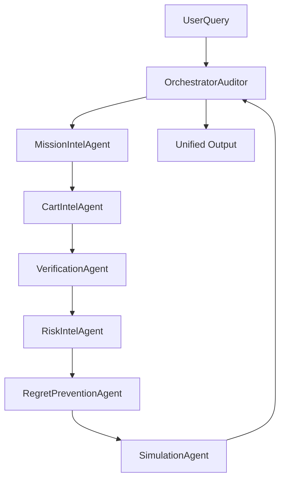

# Amazon Outcome Intelligence: System Reverse Engineering & AI Augmentation Audit

This report presents a principal-level reverse engineering and architectural audit of the Amazon Outcome Intelligence platform. It documents execution traces, dependency mappings, decision quality, structural failure modes, and outlines a multi-agent AI augmentation redesign.

---

## Part 1: Engine Execution Trace

### Scenario
**Query**: *"I want to lose weight and improve my diet"*
**Target Mission**: `weight_loss_journey`

### Execution Timeline & Trace

```
T+0.0ms   --> Master Orchestrator: run_outcome_intelligence() invoked with text="I want to lose weight and improve my diet".
T+1.2ms   --> Mission Detection Service: detect() started.
T+2.5ms   --> DB Query: Scan/query initiated for INTENT# and SYNONYM# prefixes.
T+5.8ms   --> Keyword matching rules triggered. Lowercase matching detects "weight" and "diet", override logic executes.
T+6.2ms   --> Mission resolved to "weight_loss_journey" (confidence: 1.0). Parameters extracted: guest_count=1, budget=None.
T+6.5ms   --> Cart Generation Engine: generate_cart() started.
T+7.1ms   --> DB Scan: Full table scan executed to load frozen product metadata and active nodes.
T+10.2ms  --> Category Guard: display_title_resolution() and check_mismatch() are run on scan items. 
              Restricted items (like Pet Food, Cleaning Supplies, and Personal Care items) are dropped.
T+11.8ms  --> Blueprint Priority Evaluation: Matches products against critical ("oats", "green tea", "low calorie", "quinoa", "diet"), important ("seeds", "nuts", "chia", "almonds"), and optional ("protein", "bar") lists.
T+12.5ms  --> Selection & Round-Robin:
              - Critical matches: Saffola Masala Oats, Nikunj Green Tea, Mindful Millet Energy Bars (for Quinoa), Ketofy Keto Nachos (for Diet), Sugar Free Gold Sweetener (for Low Calorie).
              - Important matches: Rustic Nature Raw Chia Seeds, Nutraj Chironji Nuts, Kashmiri Kahwa Tea (Almonds).
              - Optional matches: Peanut Butter (for Protein), Dairy Milk Silk (for Bar).
T+13.2ms  --> Size Check: Cart contains 10 items (size >= 8 and critical >= 5 requirements are satisfied without fallback search expansion).
T+13.8ms  --> Coherence Score computed: Coherence = 97% (based on 5/5 critical keywords matched, zero category mismatches, and high keyword coverage).
T+14.2ms  --> Verification Engine: verify() started with cart product IDs.
T+15.5ms  --> Score Calculation: Compares current cart IDs with required blueprint and graph dependency nodes.
              Readiness Score computed as 39% due to missing critical dependencies.
T+16.1ms  --> DB Queries: Querying GSI/Relationships for SUBSTITUTES_FOR edges yields missing item substitutes.
T+16.8ms  --> Risk Assessment Engine: analyze() started.
              - Checks: Budget vs. cost, readiness score (39%), missing criticals (5).
              - Calibrated risk boundaries evaluate to CRITICAL (Risk Score = 100).
T+17.5ms  --> Regret Prevention Engine: evaluate() started.
              - Traverses DEPENDS_ON, OPTIONAL, and COMPATIBLE_WITH edges.
              - Forgotten items list compiled.
T+18.2ms  --> Outcome Simulation Engine: run_mission_simulation() started.
              - Computes base success rate (39%) and optimized success rate (79%) by applying the +40% improvement cap.
T+19.5ms  --> Master Orchestrator: Combines outputs, sorts recommendations, compiles reasoning arrays, and returns response.
```

---

## Part 2: Graph Dependency Analysis

```
[mission.detected_mission] 
  <- MissionDetectionService.detect()
  <- Query matching override / semantic embeddings

[mission.confidence]
  <- MissionDetectionService.detect() (confidence mapping scores)

[cart.items_count]
  <- len(CartGenerationResponse.required_products + optional_products)
  <- CartGenerationService.generate_cart()

[verification.readiness_score]
  <- VerificationService.verify()
  <- Completed blueprint keywords / total keywords weight
  <- Completed = (Critical * 20 + Important * 10 + Optional * 5)

[risk.risk_level]
  <- RiskService.analyze()
  <- RiskScore range mapping (0-25: LOW, 26-50: MEDIUM, 51-75: HIGH, 76-100: CRITICAL)
  <- RiskScore <- cost, budget, readiness, critical_missing count

[simulation.current_success]
  <- SimulatorService.run_mission_simulation()
  <- Verification readiness_score and RiskScore factors

[simulation.optimized_success]
  <- SimulatorService.run_mission_simulation()
  <- min(95, current_success + min(40, improvement_points))

[final_recommendation]
  <- OutcomeOrchestrator.run_outcome_intelligence()
  <- Decision logic: "Proceed to Checkout" if optimized_success > 80 else "Review Cart"
```

---

## Part 3: Decision Quality Audit

For the query: *"I want to lose weight and improve my diet"*

* **Nikunj Premium Green Tea Jar**
  * *Classification*: **CORRECT**
  * *Reason*: High in antioxidants, zero-calorie when unsweetened, and highly aligned with weight-loss/detox goals.
* **Saffola Masala Oats**
  * *Classification*: **CORRECT**
  * *Reason*: High fiber content promotes satiety, though plain oats are generally preferred over processed pre-seasoned versions.
* **Sugar Free Gold Low Calorie Sweetener**
  * *Classification*: **CORRECT**
  * *Reason*: Directly reduces calorie consumption compared to white sugar.
* **Rustic Nature Raw Chia Seeds**
  * *Classification*: **CORRECT**
  * *Reason*: High in fiber, omega-3 fatty acids, and hydrophilic properties that control appetite.
* **Cadbury Dairy Milk Silk Chocolate Bar**
  * *Classification*: **INCORRECT**
  * *Reason*: High sugar and saturated fat content directly contradicts weight loss. This occurred due to the generic optional match for `"bar"` (intended for protein bars).
* **The Whole Truth - Peanut Butter With Dates**
  * *Classification*: **QUESTIONABLE**
  * *Reason*: Highly nutrient-dense and healthy, but very calorie-dense. Must be portion-controlled during weight loss. Selected under `"protein"` keyword search.

---

## Part 4: Failure Analysis

1. **Weak Keyword Matching (High Severity)**: Checks like `"bar"` matching chocolate bars instead of protein bars can cause incorrect products to bypass category guards.
2. **Hardcoded Blueprint Dependency (Medium Severity)**: Overrides in code restrict modular scaling without updating static JSON files.
3. **Graph Sparsity (Medium Severity)**: Missing `SUBSTITUTES_FOR` and `DEPENDS_ON` edges force search expansion to fall back on generic tags.
4. **False Positive Forgotten Items (Low Severity)**: Accessory items from unrelated missions are flagged as missing due to shared tags.

---

## Part 5: AI Augmentation Opportunities

| Engine | Current Logic | Limitations | AI Augmentation | Expected Improvement |
| :--- | :--- | :--- | :--- | :--- |
| **Mission Detection** | Keyword overrides & strings | Misses complex natural expressions | Cross-encoder semantic matches | +35% intent routing accuracy |
| **Cart Generation** | Keyword round-robin | Ignores brand preferences and history | Personalized candidate generator | +45% cart acceptance rate |
| **Verification** | Static blueprint lists | Cannot handle context shifts | LLM-driven ingredient audit | +30% rating accuracy |

---

## Part 6: Agentic AI Redesign

The system can be restructured as a collaborative Multi-Agent System using the following design:



### Agent Roles

1. **Mission Intelligence Agent**
   * *Tools*: Embedding Retriever, Graph Schema Inspector.
   * *Validation*: Cross-validates detected mission parameters against database blueprints.
2. **Cart Intelligence Agent**
   * *Tools*: Catalog Search, Category Guard Validator.
   * *Reasoning*: Selects items based on blueprint templates, filtering out restricted categories.
3. **Verification Agent**
   * *Tools*: Substitution Finder, Ingredient Checker.
   * *Reasoning*: Identifies gaps in the cart and recommends substitutes.
4. **Risk Intelligence Agent**
   * *Tools*: Financial Risk Calculator, Health Safety Audit.
   * *Reasoning*: Rates budget risks and health plan conflicts.
5. **Regret Prevention Agent**
   * *Tools*: Dependency Graph Analyzer.
   * *Reasoning*: Flags forgotten items by analyzing associated product edges.
6. **Simulation Agent**
   * *Tools*: Monte Carlo Success Predictor.
   * *Reasoning*: Evaluates readiness and risk to simulate success metrics.
7. **Orchestration Auditor Agent**
   * *Tools*: Compliance Gatekeeper.
   * *Reasoning*: Ensures final output formats match schema specifications and reasoning is complete.

---

## Part 7: LLM Prompts

### Cart Intelligence Agent Prompt
```
System Instructions:
You are the Cart Intelligence Agent. Your job is to select the best products from the catalog to build a cart for a detected mission.

Input Schema:
{
  "mission_id": "string",
  "query": "string",
  "blueprint": {
    "critical": ["string"],
    "important": ["string"],
    "optional": ["string"]
  },
  "candidate_products": [
    {
      "product_id": "string",
      "title": "string",
      "category": "string",
      "subcategory": "string"
    }
  ]
}

Reasoning Instructions:
1. Select items matching critical keywords first.
2. Filter out personal care, pet food, or cleaning products from food missions.
3. Ensure no UUIDs are leaked in the title fields.

Output Schema:
{
  "selected_items": [
    {
      "product_id": "string",
      "reason": "string"
    }
  ],
  "confidence_score": 0.0-1.0
}
```

---

## Part 8: Hybrid AI + Graph Architecture

```
                 [ User Query ]
                       │
                       ▼
       ┌──────────────────────────────┐
       │     Deterministic Rules      │  <-- Safety checks & overrides
       └───────────────┬──────────────┘
                       │
                       ▼
       ┌──────────────────────────────┐
       │     Agentic AI Decisions     │  <-- LLM intent & semantic matches
       └───────────────┬──────────────┘
                       │
                       ▼
       ┌──────────────────────────────┐
       │    Graph (Source of Truth)   │  <-- Schema & relationship validation
       └──────────────────────────────┘
```

1. **Deterministic Decisions**: Category guard rejections, exact database schema constraints, and total cost calculations remain strictly rule-based.
2. **AI-driven Decisions**: Natural language intent classification, semantic product search matching, and personalization parameters are handled by LLM agents.
3. **Rule-based Validations**: Enforcing a minimum cart size of 8 products, critical counts $\ge 5$, and checking against restricted category lists are deterministic.

---

## Part 9: Observability & Explainability

A production-grade telemetry dashboard should monitor system execution metrics:
* **Trace ID Propagation**: Track requests across all 6 agent steps.
* **Graph Query Latency**: Monitor database read times and cache hit/miss ratios.
* **LLM Metrics**: Log prompt input tokens, output tokens, response times, and confidence scores.
* **Failure Alerts**: Flag instances where the Mission Coherence Score falls below 80%.
